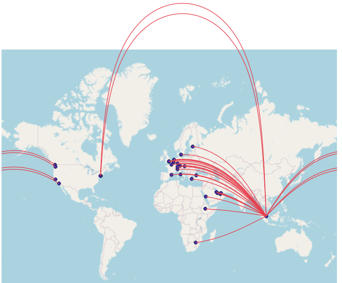

# Flight connections

SQL script to create database with flight connection paths that can then visualise using GIS applications.

> Notes:
> 
> * flight connection paths generated as greate circle lines
>

Example input data:

* `example_airport.csv` - airports data (IATA codes, coordinates etc.), to populate `airport` table
* `example_flight_connections.csv` - departure-arrival data, to populate `flight_connections` table
